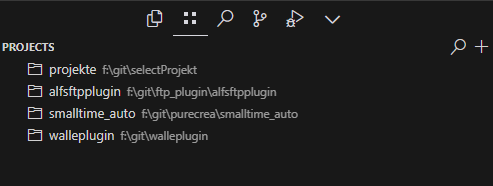

# Alfs Projects Select

A VSCode extension providing quick access to your projects through a dedicated sidebar view.

## Features

### 1. Project Overview
- Clear display of all projects in the sidebar
- Automatic sorting by last opened date
- Display of full project paths
- Tooltip with additional project information

### 2. Quick Search
- Fast project search via search field (🔍)
- Live filtering from 2 characters
- Search in project names and paths
- Auto-completion of search results

### 3. Automatic Project Detection
- Automatic addition of newly opened folders
- Update of "Last opened" timestamp
- Prevention of duplicate projects

### 4. Project Management
- Manual addition of new projects (+)
- Deletion of unused projects (🗑️)
- Direct project opening (📂)

## Installation

1. Download the VSIX file
2. Open VSCode
3. Press `Ctrl+Shift+P`
4. Type "Install from VSIX"
5. Select the downloaded VSIX file

## Usage

### View Projects
- Click the project icon in the activity bar
- All your projects are displayed sorted by last opened date
- The project path is shown as description

### Search Project
1. Click the search icon (🔍) in the project view title bar
2. Enter at least 2 characters
3. The project list filters automatically
4. Select a project using arrow keys
5. Press Enter to open

### Add Project
1. Click the plus icon (+) in the title bar
2. Enter a name for the project
3. Select the project folder
4. The project appears in the list

### Open Project
- Click the folder icon (📂) next to a project
- OR: Double-click the project name

### Delete Project
- Click the trash icon (🗑️) next to a project

## Automatic Features

- Newly opened folders are automatically added to the project list
- The "Last opened" date is updated each time a project is opened
- The project list is automatically sorted
- Duplicates are automatically prevented

## System Requirements

- VSCode version 1.80.0 or higher

## Feedback & Contributions

Report bugs and submit suggestions for improvements at:
[GitHub Repository](https://github.com/AlfMueller/alfs-projects-select)

## License

This extension is licensed under the MIT License. 